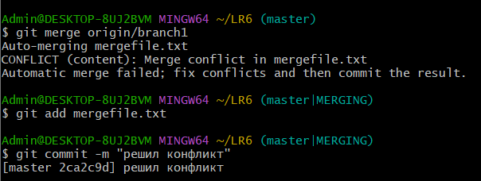
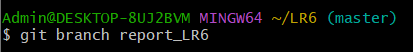
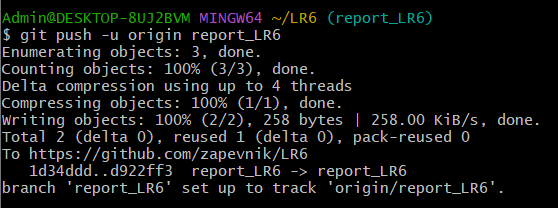

# LR6
Лабораторная работа №6
4319 Запевалов Н. Ю.
## **Цель лабораторной работы:**
*Изучение базовых возможностей системы управления версиями, опыт работы с Git Api, опыт работы с локальным и удаленным репозиторием.*

## **Решение:**

**Аккаунт в git уже был создан, клиент также был установлен на компьютер.**

**4. Настройка клиента git, ввод имени пользователя и email.**

**5. Клонирование своего удалённого репозитория на компьютер**

**6. Подтягивание изменений, сделанных через интерфейс GitHub, в локальный репозиторий.**

**7. Получение истории операций для каждой из веток.**

**8. Просмотр последних изменений.**

**9. Выполнение слияния в ветку master, разрешение конфликта (объединили информацию в конфликтующих файлах mergefile.txt).**

**10. Удаление побочной ветки.**

**11. Изменения и их фиксация с комментариями несколько раз.**

**12. Откат коммита.**

**13. Создание ветки для отчёта.**

**15. Получение истории операций в форматированном виде (сокращённый
хэш + дата + имя автора + комментарий).**

**16. Отправка локальных изменений в сетевое хранилище GitHub.** 

## **Вывод:**
*Были изучены базовые возможности системы управления версиями,получен опыт работы с Git Api и локальным и удаленным репозиторием.*
